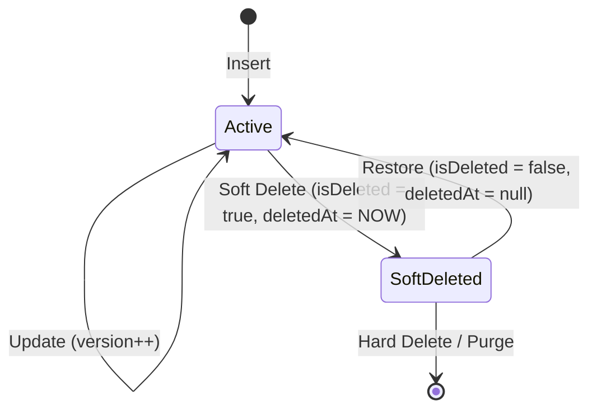

# Data Model & Context Entities: Monorepo Library Foundation

This document defines the schemas, attributes, validation rules, and structural contracts of the platform's core entities.

## 1. Context Entities (In-Memory)

### RequestContext

Represents the transient context of the active request thread, isolated via `AsyncLocalStorage`.

| Field Name | Type | Description | Validation Rules |
|------------|------|-------------|------------------|
| `traceId` | `string` | Unique trace ID for correlation across services | Required, UUID v4 format |
| `requestId` | `string` | Unique HTTP request correlation identifier | Required, UUID v4 format |
| `serviceName` | `string` | Name of the active microservice | Required, alphanumeric |
| `tenantCode` | `string` | Canonical tenant identifier for SaaS scoping | Required, alphanumeric, max 64 chars |
| `companyId` | `string` | Optional nested corporate entity identifier | Optional, UUID/Alphanumeric |
| `user` | `AuthContext` | Authenticated user credentials and profile | Optional (null for public endpoints) |
| `clientMetadata` | `object` | Client IP, user agent, and platform indicators | Required (at minimum client IP) |
| `requestTimestamp` | `Date` | Epoch timestamp when request entered the pipeline | Required |

---

### AuthContext

Represents the validated authentication state for the current request.

| Field Name | Type | Description | Validation Rules |
|------------|------|-------------|------------------|
| `userId` | `string` | Unique identifier of the authenticated user | Required |
| `sessionId` | `string` | Unique session identifier for token revocation | Required |
| `tenantCode` | `string` | Tenant mapping of the token | Required, matches `RequestContext` |
| `roles` | `string[]` | Assigned high-level roles (e.g. `admin`, `manager`) | Required (empty array if none) |
| `scopes` | `string[]` | OAuth2 scopes | Required (empty array if none) |
| `permissions` | `string[]` | Granular action permissions (e.g. `employee:read`) | Required (empty array if none) |

---

## 2. Persistence Entities (SQL & MongoDB)

### BaseEntity (PostgreSQL - TypeORM)

Abstract base entity mapped to all relational SQL tables.

| Field Name | Type | Database Mapping | Description | Validation/Autogen |
|------------|------|------------------|-------------|--------------------|
| `id` | `uuid` | Primary Key, `UUID` | Unique identifier | Generated on create (UUID v4) |
| `tenantCode` | `varchar(64)` | Column, Indexed | Tenant scoping identifier | Auto-injected from request context |
| `createdAt` | `timestamptz` | Column | Creation timestamp | Auto-generated by TypeORM |
| `updatedAt` | `timestamptz` | Column | Last update timestamp | Auto-updated by TypeORM |
| `deletedAt` | `timestamptz` | Column, Nullable | Soft deletion timestamp | Null unless soft-deleted |
| `isDeleted` | `boolean` | Column, Default `false` | Soft deletion indicator flag | Defaults to `false` |
| `version` | `int` | Column, Default `1` | Optimistic locking version | Auto-incremented on each update |
| `createdBy` | `varchar(128)` | Column, Nullable | User ID who created the record | Auto-injected from request context |
| `updatedBy` | `varchar(128)` | Column, Nullable | User ID who last updated the record | Auto-injected from request context |

---

### BaseDocument (MongoDB - Mongoose Schema)

Base schema attributes applied to all Mongoose documents.

| Field Name | Type | Database Mapping | Description | Validation/Autogen |
|------------|------|------------------|-------------|--------------------|
| `_id` | `ObjectId` | Primary Key | MongoDB Object Identifier | Generated by MongoDB |
| `tenantCode` | `String` | Field, Indexed | Tenant scoping identifier | Auto-injected via tenant plugin |
| `createdAt` | `Date` | Field | Creation timestamp | Auto-generated by Mongoose timestamps |
| `updatedAt` | `Date` | Field | Last update timestamp | Auto-updated by Mongoose timestamps |
| `deletedAt` | `Date` | Field, Nullable | Soft deletion timestamp | Null unless soft-deleted |
| `isDeleted` | `Boolean` | Field, Default `false` | Soft deletion indicator flag | Defaults to `false` |
| `version` | `Number` | Field, Default `1` | Optimistic locking version (`__v`) | Managed by optimistic locking plugin |
| `createdBy` | `String` | Field, Nullable | User ID who created the record | Injected from request context |
| `updatedBy` | `String` | Field, Nullable | User ID who last updated the record | Injected from request context |

## State Transitions (Soft Delete)

