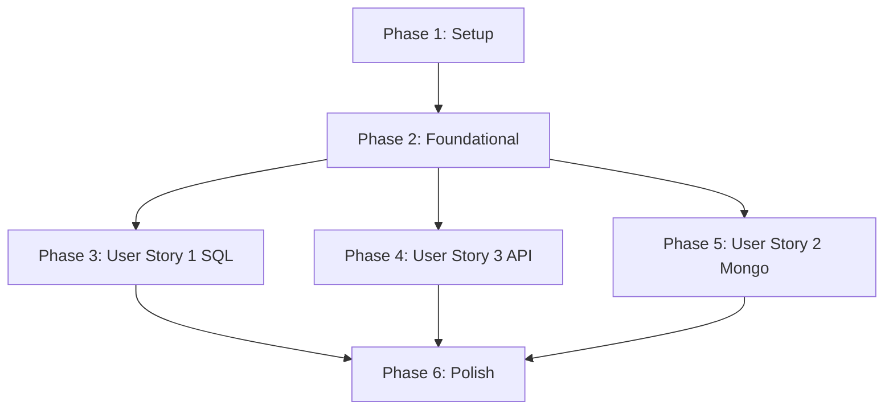

# Tasks: Monorepo Library Foundation

**Input**: Design documents from `/specs/001-monorepo-library-foundation/`

**Prerequisites**: plan.md (required), spec.md (required), research.md, data-model.md, contracts/

**Tests**: Unit tests for module factories, request context, error mappers, and guards are included as requested.

**Organization**: Tasks are grouped by user story to enable independent implementation and testing of each story.

## Format: `[ID] [P?] [Story] Description`

- **[P]**: Can run in parallel (different files, no dependencies on incomplete tasks)
- **[Story]**: Which user story this task belongs to (e.g., US1, US2, US3)
- Include exact file paths in descriptions

## Path Conventions

- Paths reference the monorepo packages structure under `libs/` and example host app under `apps/`:
  - `libs/libs-core/`
  - `libs/libs-sql/`
  - `libs/libs-mongo/`
  - `libs/libs-apis/`
  - `apps/sample-service/`

---

## Phase 1: Setup (Shared Infrastructure)

**Purpose**: Project initialization and basic workspace structure

- [X] T001 Create project workspace directory structure per `specs/001-monorepo-library-foundation/plan.md`
- [X] T002 Configure monorepo workspace configuration in `package.json` and `tsconfig.json` at repository root
- [X] T003 [P] Configure shared linting and formatting rules in `.eslintrc.js` and `prettier.config.js` at repository root

---

## Phase 2: Foundational (Blocking Prerequisites)

**Purpose**: Core infrastructure in `libs-core` that MUST be complete before ANY user story can be implemented

**⚠️ CRITICAL**: No user story work can begin until this phase is complete.

- [X] T004 Implement strongly typed configuration helper modules and base factory schemas in `libs/libs-core/src/configuration/`
- [X] T005 [P] Create custom core exception classes hierarchy in `libs/libs-core/src/exceptions/`
- [X] T006 [P] Define core context interfaces (`RequestContext`, `AuthContext`) in `libs/libs-core/src/interfaces/`
- [X] T007 [P] Implement `RequestContextService` using Node.js `AsyncLocalStorage` in `libs/libs-core/src/request-context/`
- [X] T008 [P] Implement abstract `CacheProvider` interface and memory/mock cache providers in `libs/libs-core/src/cache/`
- [X] T009 [P] Implement `LoggerService` and `TraceService` base abstract classes and default logging provider in `libs/libs-core/src/logger/` and `libs/libs-core/src/tracing/`
- [X] T010 [P] Implement abstract `HealthService` registry and `HealthIndicator` interfaces in `libs/libs-core/src/health/`
- [X] T011 Write unit tests verifying context isolation in `libs/libs-core/tests/request-context.spec.ts` (depends on T007)

**Checkpoint**: Foundation ready - user story implementation can now begin.

---

## Phase 3: User Story 1 - SQL Database Integration Layer (Priority: P1) 🎯 MVP

**Goal**: Standardized connection to PostgreSQL with multi-tenancy, health check integration, automatic transaction handling, and pagination.

**Independent Test**: Verify that the database module boots, uses the BaseRepository to query paginated records, executes transactional blocks, and maps PostgreSQL driver errors to core exceptions.

### Tests for User Story 1

- [ ] T012 [P] [US1] Write unit tests for PostgreSQL error mapper in `libs/libs-sql/tests/sql-error.mapper.spec.ts`
- [ ] T013 [P] [US1] Write unit tests for dynamic module connection factories in `libs/libs-sql/tests/sql-module.spec.ts`

### Implementation for User Story 1

- [ ] T014 [P] [US1] Define `BaseEntity` TypeORM schema decorator and default columns in `libs/libs-sql/src/base.entity.ts` (depends on T006)
- [ ] T015 [P] [US1] Implement standard pagination builder in `libs/libs-sql/src/pagination.ts`
- [ ] T016 [P] [US1] Implement generic `BaseRepository` mapping TypeORM operations in `libs/libs-sql/src/base.repository.ts` (depends on T014, T015)
- [ ] T017 [P] [US1] Implement context-aware `TransactionService` and `UnitOfWork` propagation in `libs/libs-sql/src/transaction.service.ts` and `libs/libs-sql/src/unit-of-work.service.ts` (depends on T007)
- [ ] T018 [P] [US1] Implement `SqlHealthService` mapping PostgreSQL connection status in `libs/libs-sql/src/sql-health.service.ts` (depends on T010)
- [ ] T019 [P] [US1] Implement PostgreSQL driver error mapper mapping database errors in `libs/libs-sql/src/sql-error.mapper.ts` (depends on T005)
- [ ] T020 [US1] Wire up dynamic `SqlModule` with sync/async providers in `libs/libs-sql/src/sql.module.ts` (depends on T004)

**Checkpoint**: At this point, User Story 1 is fully functional and testable independently.

---

## Phase 4: User Story 3 - API Platform Layer (Priority: P1)

**Goal**: HTTP middleware, guards, interceptors, pipes, and request context injection for microservices.

**Independent Test**: Spin up a NestJS application using `ApisModule`, inject authentication tokens, check logger metadata, and verify that rate limits and permission guards enforce request validation rules.

### Tests for User Story 3

- [ ] T021 [P] [US3] Write unit tests for the JWT authentication middleware and guards in `libs/libs-apis/tests/auth.guard.spec.ts`
- [ ] T022 [P] [US3] Write unit tests for correlation trace mapping in `libs/libs-apis/tests/trace.middleware.spec.ts`

### Implementation for User Story 3

- [ ] T023 [P] [US3] Implement `TraceMiddleware` and `RequestLogMiddleware` logging metadata in `libs/libs-apis/src/middleware/` (depends on T009)
- [ ] T024 [P] [US3] Implement decorators (`@CurrentUser`, `@TenantCode`, `@RequirePermission`, `@Public`, `@TraceId`) in `libs/libs-apis/src/decorators/` (depends on T007)
- [ ] T025 [P] [US3] Implement pluggable `AuthenticationStrategy` contract and built-in default guard in `libs/libs-apis/src/guards/auth.guard.ts` (depends on T006)
- [ ] T026 [P] [US3] Implement `PermissionGuard` and `RateLimitGuard` verifying context in `libs/libs-apis/src/guards/` (depends on T008, T025)
- [ ] T027 [P] [US3] Implement global HTTP exception filter formatting responses in `libs/libs-apis/src/filters/exception.filter.ts` (depends on T005)
- [ ] T028 [P] [US3] Implement reusable Interceptors (`LoggingInterceptor`, `AuditInterceptor`, `TimeoutInterceptor`, `MetricsInterceptor`) in `libs/libs-apis/src/interceptors/` (depends on T007)
- [ ] T029 [P] [US3] Implement reusable validation and sanitization Pipes (`ValidationPipe`, `TrimPipe`, `SanitizePipe`) in `libs/libs-apis/src/pipes/`
- [ ] T030 [US3] Wire up `ApisModule` registering global filters and guards in `libs/libs-apis/src/apis.module.ts` (depends on T004)

**Checkpoint**: User Story 3 features are fully integrated and testable.

---

## Phase 5: User Story 2 - MongoDB Integration Layer (Priority: P2)

**Goal**: Standardized connection to MongoDB using Mongoose, featuring soft deletion, timestamps, automatic tenant filtering, optimistic locking, and auditor metadata tracking.

**Independent Test**: Verify Mongoose models auto-inject metadata, queries automatically append tenant filters, and deleted records are flagged logically without database removals.

### Tests for User Story 2

- [ ] T031 [P] [US2] Write unit tests verifying Mongoose schema plugin operations in `libs/libs-mongo/tests/plugins.spec.ts`
- [ ] T032 [P] [US2] Write unit tests for Mongoose module dynamic connection setup in `libs/libs-mongo/tests/mongo-module.spec.ts`

### Implementation for User Story 2

- [ ] T033 [P] [US2] Implement schema plugins for automatic timestamps, tenant filter injection, optimistic locking, and soft deletes in `libs/libs-mongo/src/plugins/` (depends on T007)
- [ ] T034 [P] [US2] Define base document schema mappings and classes in `libs/libs-mongo/src/base-mongo.document.ts`
- [ ] T035 [P] [US2] Implement Mongoose pagination helper utility in `libs/libs-mongo/src/pagination.ts`
- [ ] T036 [P] [US2] Implement generic `BaseMongoRepository` class mapping operations in `libs/libs-mongo/src/base-mongo.repository.ts` (depends on T033, T034, T035)
- [ ] T037 [P] [US2] Implement `MongoHealthService` tracking MongoDB status in `libs/libs-mongo/src/mongo-health.service.ts` (depends on T010)
- [ ] T038 [P] [US2] Implement MongoDB driver error mapper in `libs/libs-mongo/src/mongo-error.mapper.ts` (depends on T005)
- [ ] T039 [US2] Wire up dynamic `MongoModule` registration in `libs/libs-mongo/src/mongo.module.ts` (depends on T004)

**Checkpoint**: At this point, Mongoose model scoping and soft deletes are fully integrated.

---

## Phase 6: Polish & Cross-Cutting Concerns

**Purpose**: Workspace integration examples, end-to-end validation, and package compile verification

- [ ] T040 Create a sample `AppModule` and `Controller` showing example usage of all libraries in `apps/sample-service/src/`
- [ ] T041 Run quickstart.md validation scenarios to verify end-to-end libraries integration in `apps/sample-service/`
- [ ] T042 Build typescript compilation schemas for all packages in `libs/` and verify compiled packages bundle correctness

---

## Dependencies & Execution Order

### Phase Dependencies

- **Setup (Phase 1)**: No dependencies - can start immediately.
- **Foundational (Phase 2)**: Depends on Setup completion - BLOCKS all user stories.
- **User Stories (Phases 3 to 5)**: Depend on Foundational phase completion.
  - User Story 1 (P1) and User Story 3 (P1) can proceed in parallel once Phase 2 is completed.
  - User Story 2 (P2) depends on core configuration and exceptions, but can run in parallel with US1 and US3.
- **Polish (Phase 6)**: Depends on all user stories being complete.



### Parallel Opportunities

- All Phase 1 Setup tasks can run in parallel.
- All Phase 2 Foundational tasks marked `[P]` (T005 to T010) can run concurrently.
- Once Phase 2 completes, Phase 3 (US1), Phase 4 (US3), and Phase 5 (US2) can run concurrently since they are isolated packages in the monorepo (`libs-sql`, `libs-apis`, `libs-mongo`) and only depend on the completed `libs-core` package.
- Within each story, the factory tests (`[P]`) can be written in parallel.

---

## Parallel Example: User Story 1 (SQL)

```bash
# Launch test creation tasks:
Task: "Write unit tests for PostgreSQL error mapper in libs/libs-sql/tests/sql-error.mapper.spec.ts"
Task: "Write unit tests for dynamic module connection factories in libs/libs-sql/tests/sql-module.spec.ts"

# Implement isolated components:
Task: "Define BaseEntity TypeORM schema decorator in libs/libs-sql/src/base.entity.ts"
Task: "Implement standard pagination builder in libs/libs-sql/src/pagination.ts"
```

---

## Implementation Strategy

### MVP Scope (Phase 1 + Phase 2 + Phase 3 User Story 1 Only)

1. Complete Phase 1 Setup.
2. Complete Phase 2 Foundational (ensures `libs-core` is verified with passing tests).
3. Complete Phase 3 User Story 1 (`libs-sql`).
4. **STOP and VALIDATE**: Verify that a microservice can connect to PostgreSQL, perform CRUD via repository, run transactions, and mapping database errors.
5. Merge MVP.
6. Progress with Phase 4 (`libs-apis`) and Phase 5 (`libs-mongo`) incrementally.
